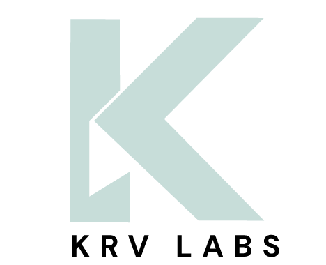

<h1 align="center">
  
   
  <strong>krv labs</strong>
</h1>

  <em>Clinical Trials for AI Models — preventing healthcare AI deployment disasters by rigorously stress-testing models before they reach patients.</em>
   
  
    70% of healthcare AI models fail to reach production because they break under real-world conditions. krv labs bridges the gap between offline validation and clinical reality by stress-testing models against the chaos of actual hospital environments—missing data, workflow shifts, and population drift.
  

  
  
  

---

### 🛠️ What We Do

The **krv labs** platform subjects clinical AI models to thousands of realistic scenarios to identify failure modes that traditional metrics miss:

*   **Resilience Testing:** Simulating EHR outages, missing labs (30%+), and sensor drift to ensure graceful degradation.
*   **Stability Analysis:** Verifying that minor, clinically insignificant data shifts don't flip critical predictions.
*   **Generalizability:** Stress-testing models across diverse age groups, ethnicities, and comorbidity combinations.
*   **Sanity Checks:** Injecting impossible data and logic errors to ensure models catch nonsense instead of amplifying it.

### 📈 Why It Matters

Traditional validation uses clean, static datasets. Real hospitals are messy. We help teams ship trustworthy models in weeks—not months—by pinpointing exactly where and why a model will break in production.

---

  <em>Backed by NVIDIA Inception, Berkeley SkyDeck, PAD-13, and TUM Venture Labs.</em>

